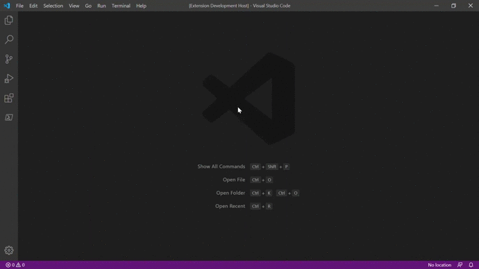

# SkyWeather Plugin for Visual Studio Code


You can see different parameters of current weather in any city you want

## Installation from repository

```
git clone https://github.com/DakEnviy/skyweather.git
cd skyweather
npm i
npm i vsce -g
vsce package .
```

## Quickstart

Click the `No location` button in status bar and enter location in format `{city name}` or `{city name},{contry code}`



## Requirements

For installation via github download [Node.js](https://nodejs.org)

## Features

* Showing temperature in °C

## Release Notes

### 1.1

- Force weather update
- Tests for everything
- Receiving city name from API

### 1.0

- Showing temperature and setting location


-----------------------------------------------------------------------------------------------------------

## Extension Settings

Main settings of the plugin (**required**):

* **[settings.location](https://github.com/DakEnviy/skyweather#location)**: set location

### Location

```
Moscow
Moscow,Ru
```

You can find country code from [Wikipedia](https://wikipedia.org/wiki/ISO_3166-1#Current_codes)


<!-- ## Known Issues

Calling out known issues can help limit users opening duplicate issues against your extension. -->


